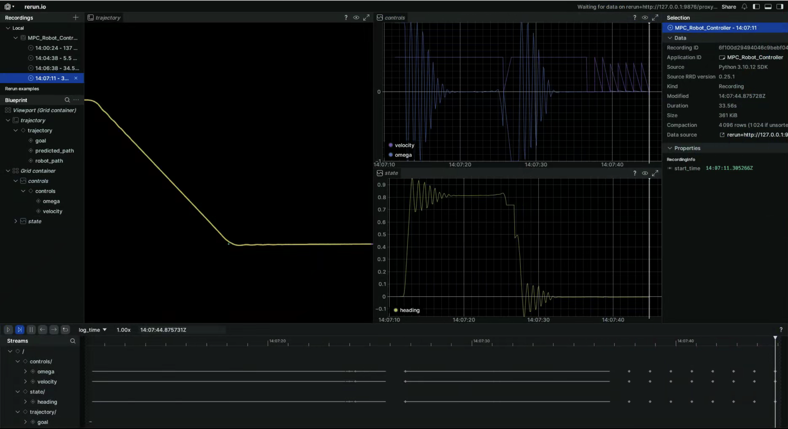

# mpc-controller
This repo implements MPC Control to drive the turtlebot3

## MPC Algorithm

States:
- \(x\): x position
- \(y\): y position
- \(\theta\): heading angle

Controls:
- \(v\): linear velocity
- \(\omega\): angular velocity

Dynamics:
```math
\begin{align*}
\dot{x} &= v \cdot \cos(\theta) \\
\dot{y} &= v \cdot \sin(\theta) \\
\dot{\theta} &= \omega
\end{align*}
```

```math
\begin{align*}
x_{k+1} &= x_k + v_k \cdot \cos(\theta_k) \cdot dt \\
y_{k+1} &= y_k + v_k \cdot \sin(\theta_k) \cdot dt \\
\theta_{k+1} &= \theta_k + \omega_k \cdot dt
\end{align*}
```

Cost Function:
```math
J = \sum_{i=0}^{N-1} \left( (x_i - x_{goal})^2 + (y_i - y_{goal})^2 + (\theta_i - \theta_{goal})^2 + \lambda_v v_i^2 + \lambda_\omega \omega_i^2 \right)
```

Constraints:
```math
v_{min} \leq v \leq v_{max}
```
```math
-\omega_{max} \leq \omega \leq \omega_{max}
```

Optimization:
- Use `scipy.optimize.minimize` with SLSQP method

```math
\text{minimize } J \text{ subject to dynamics and constraints}
```

## Visualization with Rerun


